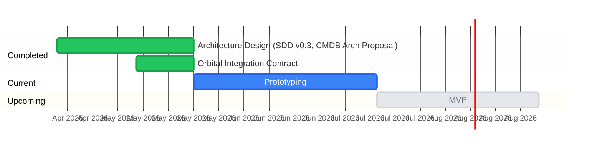

# Roadmap

## Recent accomplishments

- **2026-06-14** — Dispatch rewrite: `POST /dispatch` (content-routed) replaces `/consume`+`/mapping`; mapping persists in `<cb-name>-mapping` ConfigMap with OwnerReference; event-driven debounced Divergence Reporter replaces ticker; bundler orbital client updated (force→reject, new divergence API endpoints); controller config migrated to envconfig; e2e-validated against live minikube+orb; `RetryOnConflict` wraps ConsumeServer status update and mapping ConfigMap write — closes the persistent 409 on orb's Layers modal under reconciler race
- **2026-06-11** — Divergence pipeline feature-complete: Reporter (Spike 7), mapping layer (7a), takeover handler (7b); ADRs 004–006; refactored mapToSpec + setFieldOnServer to generic JSON round-trip + reflection
- **2026-06-08** — Bundler service (Spike 3) done: POST /bundle, sidecar deployment, Dockerfile multi-target build, ACR push targets
- **2026-06-03** — Renamed /enrich → /bundle; dropped jobId from bundler API; added bundler sequence diagram

## Development Timeline

**Note:** All future dates are subject to change.

---

## Spikes

Each spike is a question to answer. Design spikes are settled decisions that shaped the architecture before implementation started. Implementation spikes are the prototype work items.

| # | Spike | Key Question | Owner | Status | Open items |
|---|---|---|---|---|---|
| D1 | Architecture design | What is the right pattern for cloud-authored, edge-enforced configuration management at the Galleon? | Daniel | ✅ Done (May 24) | CCP-authored, edge-enforced; K8s controller pattern; CMDB not in reconciliation path; 4 invariants from SDD Key Decision 5 |
| D2 | Orbital integration contract | How does configbundle plug into Orbital's OCI publish pipeline as an enricher? | Daniel | ✅ Done (May 24) | `POST /bundle` enricher API; Orbital is sole OCI producer; all-or-nothing enrichment; retry + timeout behavior defined; Orbital enricher endpoint live |
| D3 | Edge agent vs controller | Should the edge agent be a separate sidecar, or can the ConfigBundle Controller absorb the OCI pipeline? | Daniel | ✅ Done (May 24) | No separate agent; controller owns full pipeline (poll → verify → write CR → decompose); orb owns Dgraph import; ConfigBundle CR is the sole handoff artifact |
| 1 | Go module scaffold | Can we get `kubebuilder init` + CI running as a clean starting point? | — | ✅ Done (May 26) | kubebuilder init with `--domain armada.ai --plugins go/v4`; `go.mod` at `github.com/armada/configbundle`; Makefile; CRD generation pipeline. CI (lint + test on PR) not yet wired. |
| 2 | Bundle package | What are the right OCI layer types and media type constants for the importable library? | — | ✅ Done (Jun 1) | `bundle/mediatype.go`: `MediaTypeManifest`, `MediaTypeData`, `MediaTypeSchema`. Already imported by `consume.go`. Orb is service-only (no exportable Go packages) — constants live here as the canonical definition for this module. |
| 3 | Bundler service (`POST /bundle`) | Does the enricher work end-to-end with Orbital's publish pipeline? | Daniel | ✅ Done (Jun 8) | Handler, GraphQL client, config, tests all implemented. Dockerfile (multi-target, shared builder with controller). `make docker-build-bundler` + `make run-bundler`. Deploys as sidecar in Orbital pod (separate image, `localhost:8020`). Sidecar added to `orbital/deploy/base/deploy.yaml`. **Pending:** end-to-end validation against live Orbital (trigger publish with `{"bundlers": ["http://localhost:8020/bundle"]}`). |
| 4 | ConfigBundle CRD | What is the right schema for the ConfigBundle CR, its status, and the domain child CR types? | — | ✅ Done (May 26) — iDRAC domain | `api/v1/`: ConfigBundle, ServerConfig, IdracSpec (all 8 fields from Orbital IdracSettings). CR naming: hostname (settled). Printer columns, status conditions, phase enum. `clusters` domain (EksaConfig) not started. |
| 5 | Controller — OCI pipeline | Can the controller poll Zot, cosign-verify, import to orb, and write the ConfigBundle CR reliably? | — | ✅ Done (superseded — May 28/Jun 1) | Initially implemented as a Puller (`ctrl.Runnable` polling Zot via oras-go + cosign). Superseded in the same session by the ConsumeServer consumer migration (see entry below). The `+listType=map +listMapKey=serviceTag` annotation and SSA conflict-avoidance logic (inspect managedFields, omit `local:admin`-owned fields) were preserved and moved into ConsumeServer. oras-go, cosign, and go-containerregistry dependencies removed. |
| 5a | ConsumeServer — consumer migration | Should the CB Controller poll Zot directly, or should orb dispatch to it when a new artifact lands? | — | ✅ Done (Jun 1) | Replaced Puller with orb dispatch model. CB Controller now exposes `POST /consume` (HTTP server as `ctrl.Runnable`). orb calls `/consume` after completing its own Zot pull and Dgraph import; CB Controller receives the pre-extracted ConfigBundle manifest and applies it via SSA without ForceOwnership (managedFields inspection preserved from Spike 5). Removed oras-go, cosign, go-containerregistry dependencies. `ORB_ENDPOINT` env var superseded by inbound HTTP; CB Controller's listen address is the new config surface. |
| 6 | Controller — decomposition | Can the controller decompose a ConfigBundle CR into domain child CRs via SSA, respecting local overrides? | — | ✅ Done (May 26) — iDRAC domain | SSA with ForceOwnership on child CRs — **correct as implemented** (local overrides are at ConfigBundle CR level only; child CRs are derived state); ownerReferences + cascade delete verified; hostname-based CR naming; envtest suite (4 cases) + e2e suite (3 cases) passing |
| D4 | Divergence contract review | Is the cb-controller divergence contract (from orbital repo) ready for implementation? What open design questions remain? | Daniel | ✅ Done (Jun 11) | Contract reviewed. Three open items resolved: D4a, D4b, D4c — see ADRs 004–006 in `docs/decisions/`. |
| D4a | `when` semantics for override first-seen | How does cb-controller determine when a field was first overridden by `local:admin`? | Daniel | ✅ Done (Jun 11) | Use `managedFields[].time` for MVP. No annotation tracking. Orbital's `DivergenceEntry.first_seen_at` is the stable first-seen. [ADR-004](docs/decisions/004-divergence-when-semantics.md) |
| D4b | Mapping translation decision (Q2) | Should the K8s-path → orbId translation live in the OCI artifact (mapping layer) or somewhere else? | Daniel | ✅ Done (Jun 11) | D2 confirmed: separate `mapping.json` OCI layer. CB Controller sends K8s paths; orb translates. Q2 in the contract was stale. [ADR-005](docs/decisions/005-divergence-mapping-layer.md) |
| D4c | Takeover pipeline ordering | Where in the consume path does `spec.takeover[]` get processed? | Daniel | ✅ Done (Jun 11) | Two-pass: normal SSA apply first, then takeover with force-conflicts. Takeover runs regardless of normal apply success. Code in consume handler. [ADR-006](docs/decisions/006-divergence-takeover-pipeline.md) |
| 7 | Divergence reporter | Can the controller detect field-level local overrides and report them to orb? | Daniel | ✅ Done (Jun 11) | Scheduled `ctrl.Runnable` (cron via `DIVERGENCE_REPORTER_SCHEDULE`, default `*/5 * * * *`). For each ConfigBundle CR: inspect `managedFields`, extract paths owned by `local:admin`, read intended values from last-applied manifest, read override values from current CR, POST full replace-not-merge array to orb (`POST {ORB_DIVERGENCE_INTAKE_URL}`). Default off via `DIVERGENCE_REPORTER_ENABLED=false`. Contract: `orbital/docs/plans/divergence-cb-controller-contract.md`. **Prerequisite:** `+listType=map +listMapKey=serviceTag` on `servers[]` (already done). |
| 7a | Mapping layer in bundler | Can the bundler produce a `mapping.json` OCI layer alongside the manifest layer? | Daniel | ✅ Done (Jun 11) | Extend bundler GraphQL query to fetch `orbId` per server/idrac. Produce `mapping.json` layer: flat list of `{path, orbId}` entries. Return two layers from `POST /bundle` instead of one. Add `MediaTypeMapping` to `bundle/mediatype.go`. |
| 7b | Takeover handler | Can the controller process `spec.takeover[]` entries to force cloud intent over local overrides? | Daniel | ✅ Done (Jun 11) | Add `Takeover []TakeoverEntry` to `ConfigBundleSpec`. After main SSA apply, process each takeover entry with `--force-conflicts` scoped to the field path. Local manager loses ownership. cb-bundler queries `GET /api/v1/divergence/resolutions/pending-force` and calls `POST /api/v1/divergence/resolutions/:id/consumed` after push. |
| 8 | End-to-end integration test | Can we exercise the full pipeline (bundler → Orbital → ACR/Zot → orb → CB Controller → applied CR) in a single test run? | — | Not started | Multi-repo pipeline test, lives in CB Controller repo (it's the final consumer and where "did the manifest apply" assertion lives). Test entry point: `POST /import/artifact` on orb (unsigned zip, no cosign needed). Validates: manifest round-trip fidelity, SSA apply, managedFields inspection, decomposition to child CRs. Requires bundler (Spike 3) to produce realistic artifacts. |

---

## What We've Built

| Item | Completed | Summary |
|---|---|---|
| Architecture Design | Apr 16 – May 24 | SDD v0.3: 5 key design decisions (air-gapped first, graph CMDB, GraphQL API, K8s controller pattern, local override via SSA field managers). CMDB Architectural Proposal (Sedar): eliminated CMDB-driven reconciler in favor of K8s controller pattern; resolved edge agent question (no separate binary). |
| Orbital Integration Contract | May 8 – May 24 | `POST /bundle` enricher API fully specified: request/response schema, retry + timeout behavior, OCI layer structure, base64 encoding, local end-to-end test flow. Orbital's enricher endpoint implemented and live. `configbundle-integration.md` is the source of truth. |
| Project scaffold (Spike 1) | May 26 | kubebuilder v4 init; `go.mod`; Makefile with generate/manifests/install/run targets; CRD generation pipeline via controller-gen. `cmd/main.go` wired for ConfigBundle controller. |
| ConfigBundle + ServerConfig CRDs (Spike 4) | May 26 | `api/v1/`: ConfigBundle (datacenter, servers[], status with phase/conditions/lastAppliedDigest), ServerConfig (serviceTag, hostname, oobIP, idrac), IdracSpec (all 8 desired-state fields from Orbital IdracSettings). CR name = `strings.ToLower(hostname)`. kubebuilder annotations, printer columns, generated CRD YAML. |
| ConfigBundle Controller — decomposition (Spike 6) | May 26 | Reconciler decomposes ConfigBundle into ServerConfig child CRs via SSA (field manager: `configbundle-controller`). ownerReferences set (cascade delete verified on minikube). Desired state enforcement: out-of-band mutations on child CRs are restored. omitempty removed from bool fields so `false` is enforced. Envtest suite (4 cases) + e2e suite (3 cases, `make test-e2e-local`). |
| ConfigBundle Controller — OCI pipeline (Spike 5) | May 28 | Initial Puller implementation (`ctrl.Runnable`): digest-skip, managedFields inspection, orb import before CR write, SSA apply without ForceOwnership. `bundle/` package with OCI media type constants. HTTPOrbClient (stdlib zip + HTTP). HTTPOCIClient stub. `GraphImported` condition + condition constants. `ORB_ENDPOINT` env var. Envtest suite (6 cases) + unit tests. **Superseded same session by ConsumeServer migration (Spike 5a).** |
| ConsumeServer — consumer migration (Spike 5a) | Jun 1 | Replaced Puller with orb dispatch consumer model. CB Controller exposes `POST /consume` as a `ctrl.Runnable` HTTP server. orb calls `/consume` post-import; CB Controller receives the pre-extracted ConfigBundle manifest and applies it via SSA without ForceOwnership. managedFields inspection and `local:admin` omission logic preserved from Spike 5. Removed oras-go, cosign, go-containerregistry dependencies. |

| Bundler service (Spike 3) | Jun 8 | `POST /bundle` enricher implemented: handler, GraphQL client (`OrbitalQuerier` interface), envconfig-based config (`BUNDLER_PORT`, `ORBITAL_GRAPHQL_URL`, `ORBITAL_BEARER_TOKEN`), 8 unit tests. Dockerfile with multi-target build (shared builder stage, `--target bundler` / `--target controller`). `make docker-build-bundler`, `make run-bundler`. Deploys as sidecar in Orbital pod (`deploy/base/deploy.yaml`). API: `POST /bundle` with `{"datacenter": "..."}` → `[{mediaType, data (base64)}]`. Correlation via `X-Request-ID` header, not body field. |
| Orb — full import pipeline (external) | Jun 1 | Both OCI poll path (`ORB_ENABLE_OCI_REGISTRY=true`, cosign hard-wired) and `POST /import/artifact` (direct upload, no cosign) fully implemented. `POST /import/subgraph` available (graph-only, no consumer dispatch). Currently local-only (Docker Compose); K8s deployment is orb Spike 15 (not started). |

*Full design decisions and architectural rationale: [SDD DCIM & CMDB for Galleon Digital Twin in Atlas.pdf](SDD%20DCIM%20%26%20CMBD%20for%20Galleon%20Digital%20Twin%20in%20Atlas%20%283%29.pdf) · [CMDB_Architectural_Proposal.docx](CMDB_Architectural_Proposal.docx) · [configbundle-integration.md](configbundle-integration.md)*

---

## MVP Definition

> Working draft — scope confirmed once prototype spikes complete.

### Cloud
- ✅ Architecture design — CCP-authored, edge-enforced pattern settled
- ✅ Integration contract — `POST /bundle` API defined and Orbital side live
- ✅ Bundler service — `POST /bundle` implementation (Spike 3). Pending: e2e validation against live Orbital
- ✅ `api/v1` package — ConfigBundle and child CR type definitions, importable by Orbital (Spike 4)
- ✅ `bundle/` package — OCI media type constants, importable library (Spike 2)

### Edge (Galleon Mgmt Cluster)
- ✅ ConfigBundle Controller — OCI pipeline: ConsumeServer exposes `POST /consume`; orb dispatches after Zot pull + Dgraph import; SSA apply with managedFields inspection (Spike 5 → 5a)
- ✅ ConfigBundle Controller — decompose ConfigBundle CR into domain child CRs via SSA (Spike 6)
- ⬜ Divergence reporting — field-level divergence detection, report to orb, takeover handling (Spike 7 + 7a + 7b). Blocked on design decisions D4a/D4b/D4c

### Explicitly out of scope for v1
- X Config Controllers (ServerConfig, NetworkConfig, etc.) — domain-specific, owned by teams consuming the ConfigBundle CR
- Named server-side enrichers — per-request URLs are sufficient; governance requirement not yet present
- Orbital bearer token enforcement — depends on Orbital Spike 11 (authorization)

### Prerequisites for domain controllers (post-MVP, required before ServerConfig controller ships)
- **iDRAC credentials model** — the ServerConfig controller needs iDRAC credentials to issue Redfish calls. For now: manually provisioned K8s Secret in the controller's namespace. Secret naming convention, rotation strategy, and whether to use per-server or datacenter-wide secrets must be designed before the controller is implemented.

### Post-MVP backlog
- **Local override RBAC** — MVP assumes a single local admin with field manager `local:admin` (fixed string). Post-MVP: define how multiple admins are represented (per-person `local:<admin-id>` managers), how the Puller enumerates them from managedFields, and what RBAC controls who can act as a local field manager on the ConfigBundle CR.
- **`POST /import/replay/:importID` on orb** — re-dispatch a previously imported artifact to consumers. Nice-to-have for debugging and re-processing; not a blocker for MVP. Add if warranted after end-to-end testing reveals the need.

---

## External Integration Dependencies

| System | Role | Status |
|---|---|---|
| **Orbital** | Calls `POST /bundle` during publish; provides GraphQL data model for bundler query; sole OCI producer | Integration contract defined; enricher endpoint live. Bundler runs as sidecar in Orbital pod — enricher URL is `http://localhost:8020/bundle` |
| **Zot** | Edge OCI registry — orb polls this (not CB Controller directly); never ACR directly | Deployment model TBD (per Galleon) |
| **cosign** | Signs artifacts (Orbital side); verification responsibility shifted to orb as part of consumer migration — orb verifies before dispatching to CB Controller | Public key distribution to Galleons: TBD; cosign removed from CB Controller dependencies |
| **orb** | Pulls from Zot, imports to Dgraph, dispatches to CB Controller via `POST /consume`; stores `mapping.json` layer by digest; hosts divergence intake (`POST /api/v1/divergence`) and translates K8s paths → orbId+field; publishes divergence snapshots to S3 | Dispatch pipeline fully implemented. Divergence intake + mapping layer storage: not started (orb prerequisite A+B in `divergence-cb-controller-contract.md`). Currently local-only (Docker Compose); K8s deployment manifests not yet available (orb Spike 15). `POST /import/artifact` is the CB Controller integration test entry point (unsigned zip, no cosign). |
| **ACR** | Cloud OCI registry; Zot polls ACR on connectivity | Azure-native; existing Armada infrastructure |
