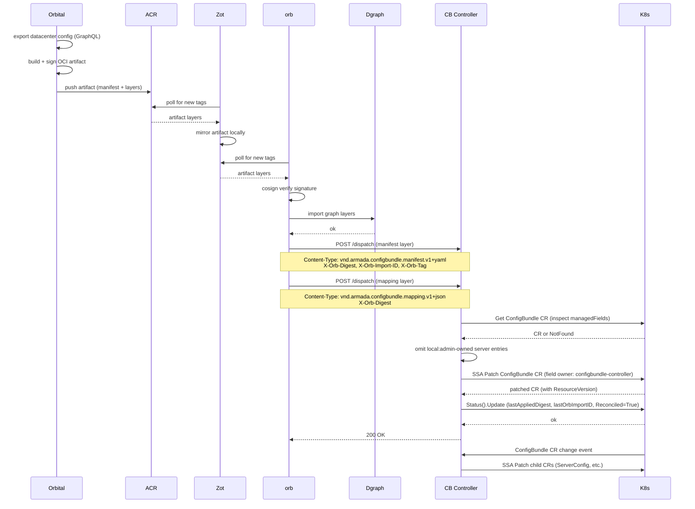

# Edge Reference

> **When to load this file:** Read this before working on the ConfigBundle Controller's consume pipeline (HTTP handler, SSA apply, status update), divergence reporting, or the edge registry (Zot).

---

## Overview

There is no separate edge agent binary. The ConfigBundle Controller is a passive consumer: it does not poll Zot, does not pull OCI artifacts, and does not call orb's import API. Instead, orb's dispatch pipeline handles all OCI mechanics (poll Zot, cosign verify, graph import) and then POSTs the manifest layer bytes to the ConfigBundle Controller via `POST /consume`. The ConfigBundle Controller receives the manifest, applies the ConfigBundle CR via SSA (respecting local admin overrides), and updates status.

---

## End-to-end dispatch flow

---

## Key decisions

- **No separate edge agent** — The ConfigBundle Controller, ConsumeServer, and Divergence Reporter are all part of the same binary on the Mgmt Cluster. Do not create an `edge-agent` binary.
- **Single dispatch endpoint, content-routed** — `POST /dispatch` is the only inbound HTTP endpoint. Routes by `Content-Type`; manifest → apply CR; mapping → write ConfigMap; else 415. Do NOT add `/consume` or `/mapping` back.
- **Mapping persists in a per-CR ConfigMap** — `<cb-name>-mapping` with OwnerReference to the CR (`controller: true`). K8s GC deletes it when the CR is deleted. Do NOT store mapping in-memory or in CR status.
- **CB Controller is a passive consumer** — it never polls Zot, never pulls OCI artifacts, and never calls cosign. Orb owns the full OCI pipeline including cosign verification.
- **CB Controller never needs OCI credentials** — orb handles all OCI mechanics including cosign verification. The ConfigBundle Controller receives plain manifest bytes over HTTP.
- **omitAdminOwnedServers is mandatory in the consume path** — the ConsumeServer handler must inspect `managedFields` and omit fields owned by `local:admin` before applying the SSA patch.
- **If orb is down, CB Controller receives no updates until orb recovers and re-dispatches** — there is no fallback polling mechanism.
- **Single field manager** — `configbundle-controller` owns all fields it writes on both the ConfigBundle CR and child CRs. Local admin overrides use `local:admin` — but ONLY on the ConfigBundle CR, never on child CRs.
- **Local overrides are at ConfigBundle CR level only** — child CRs are derived state, not an override surface. The ConsumeServer applies the ConfigBundle CR spec WITHOUT `ForceOwnership` so SSA preserves locally-owned fields. The Decomposition Reconciler applies child CR specs WITH `ForceOwnership` because child CRs always faithfully reflect the ConfigBundle CR (including any local overrides already merged into it).
- **Divergence is data, not an error** — a disconnected Galleon that hasn't received a dispatch is in a valid (diverged) state. Do not block or error on lack of convergence.
- **Divergence Reporter fires on `local:*` managedFields change only** — the predicate ignores spec-only changes. Quiet-state: zero reconciles, zero POSTs to orb.
- **Orb dispatches manifest before mapping** — the mapping handler returns 409 if the CR isn't found by digest; orb retries. This is the intended ordering protocol.

---

## ConfigBundle Controller — full responsibility list

The controller is a single binary (Mgmt Cluster) with three goroutines managed by controller-runtime:

### ConsumeServer (`ctrl.Runnable`) — HTTP-driven, not time-driven

`NeedsLeaderElection() = false` — all replicas serve (applies are idempotent via SSA).

Listens on `CB_CONTROLLER_PORT` (default `:8095`).

**`POST /dispatch`** — single endpoint, routes by `Content-Type`:

| Content-Type | Action |
|---|---|
| `application/vnd.armada.configbundle.manifest.v1+yaml` | Apply ConfigBundle CR via SSA |
| `application/vnd.armada.configbundle.mapping.v1+json` | Write `<cb-name>-mapping` ConfigMap |
| anything else | `415 Unsupported Media Type` |

`X-Orb-Digest` is required on all requests (400 if absent). `X-Orb-Import-ID` and `X-Orb-Tag` are read for the manifest path only (for status and traceability).

**Manifest apply pipeline (in order):**
1. **Parse manifest** bytes into ConfigBundle CR spec fields
2. **Inspect `managedFields`** on the existing ConfigBundle CR — identify fields owned by `local:admin`
3. **`omitAdminOwnedServers`** — remove any server entries (or server fields) from the patch that are owned by `local:admin` to avoid SSA 409 conflicts
4. **SSA patch** WITHOUT `ForceOwnership`, field manager `configbundle-controller` — SSA preserves locally-owned fields. See crd-context.md § SSA conflict resolution.
5. **Process `spec.takeover[]`** — for each entry, submit a narrow SSA apply containing only that field with `ForceOwnership`, reclaiming ownership from `local:admin`. Runs regardless of step 4 success (ADR-006).
6. **Record last-applied manifest** for the Divergence Reporter to compare against
7. **Update ConfigBundle CR status** (status subresource): `lastAppliedDigest` (`X-Orb-Digest`), `lastOrbImportID` (`X-Orb-Import-ID`), `lastAppliedAt`, `Reconciled=True` condition

**Mapping store pipeline:**
1. **Look up ConfigBundle CR** by scanning all CRs in the namespace for `status.lastAppliedDigest == X-Orb-Digest`; returns 409 if not found (manifest must arrive first — orb retries)
2. **Write `<cb-name>-mapping` ConfigMap** with OwnerReference to the CR (`controller: true, blockOwnerDeletion: true`) so K8s GC deletes the ConfigMap when the CR is deleted
3. ConfigMap shape: `data["digest"]` = digest, `data["mapping.json"]` = raw mapping bytes

**Response codes (both paths):**
- `200` — applied/stored successfully
- `409` — mapping arrived before manifest (CR not yet visible); orb retries
- `415` — unknown Content-Type
- `500` — apply/write failed; orb records failure and may retry

### Decomposition Reconciler (`ctrl.Reconciler`) — event-driven, triggered by ConfigBundle CR changes
1. **Decompose ConfigBundle CR** into domain child CRs via SSA WITH `ForceOwnership` — child CRs faithfully reflect the ConfigBundle CR (including any local overrides already merged into it)
2. **Set ownerReferences** on child CRs so deletion cascades when ConfigBundle is deleted
3. **Update ConfigBundle CR status**: `phase`, `Reconciled` condition

### Divergence Reporter (`ctrl.Reconciler`) — event-driven with debounce + heartbeat + bootstrap
1. **Predicate fires on `local:*` managedFields change** — compares `FieldsV1.Raw` bytes for any `local:*` manager between old and new CR; non-local-admin changes are ignored
2. **Debounce:** `lastEventAt[key]` set on predicate match; reconciler returns `RequeueAfter(remaining)` until `DIVERGENCE_REPORTER_DEBOUNCE` (default `5s`) of quiet time has elapsed
3. **Compute overrides** from current CR's `managedFields` vs last-applied manifest; read mapping from `<cb-name>-mapping` ConfigMap
4. **Cold-start guard:** if `lastManifests[cb.Name]` has no entry (controller hasn't seen a manifest dispatch for this CR yet), **skip the POST** — posting nil would wipe orb's store (replace-not-merge). Wait for next bundle dispatch to populate intent, OR for the bootstrap loader to rehydrate from K8s state (see below).
5. **Content-hash dedup:** SHA-256 of canonical JSON; skip POST if override set is unchanged since last POST (in-memory)
6. **POST the full override set** to orb's divergence intake (`ORB_DIVERGENCE_INTAKE_URL`) — replace-not-merge semantics; exponential backoff via controller-runtime work queue on error

#### Restart durability — three guards work together

The reporter's `lastManifests` (intent baseline) and `lastPostedHash` (dedup cache) were originally in-memory only, causing two failure modes:

| Failure | Without guards | With guards |
|---|---|---|
| **Controller restart loses intent baseline** | Reporter posts empty set → wipes orb | Bootstrap rehydrates `lastManifests` from per-CR ConfigMap on startup; cold-start guard skips POST if still empty |
| **orb store wiped (PVC failure, fresh edge)** | Controller's dedup cache says "already posted" → never re-sends → orb stays empty | Heartbeat ticker clears dedup cache periodically → next reconcile re-posts |

**The three guards:**

1. **Persistence (write side):** On every successful manifest apply (`consume.go`), the spec is written to the per-CR ConfigMap (`<cb-name>-mapping`) under `last-applied-spec.yaml`. Same CM as the path-mapping; lifecycle tied via OwnerReference.

2. **Bootstrap rehydration (read side):** At controller startup, `lastManifestLoader` (a `manager.Runnable`) lists ConfigBundles in the configured namespace, reads each one's persisted spec, and calls `SetLastManifest`. Log line: `divergence-reporter.bootstrap rehydrated lastManifests {"configbundles": N, "loaded": M}`.

3. **Heartbeat ticker:** Every `DIVERGENCE_REPORTER_HEARTBEAT` (default `5m`), `divergenceHeartbeat` (a `manager.Runnable`) lists CRs, clears `lastPostedHash` for each, and triggers `Reconcile` directly. Bounds orb-wipe recovery latency to one interval. Set `0` to disable.

The cold-start guard (step 4 above) is the safety net: if persistence/bootstrap both failed somehow and `lastManifests` is empty, the reporter refuses to wipe orb. It waits for a real intent dispatch.

---

## Environment variables (ConfigBundle Controller)

| Variable | Default | Description |
|---|---|---|
| `CB_CONTROLLER_PORT` | `:8095` | Listen address for `POST /dispatch` (ConsumeServer) |
| `ORB_DIVERGENCE_INTAKE_URL` | `http://localhost:8010/api/v1/divergence` | Where the Divergence Reporter POSTs override entries |
| `DIVERGENCE_REPORTER_DEBOUNCE` | `5s` | Quiet window after last `local:*` managedFields change before reporting |
| `DIVERGENCE_REPORTER_HEARTBEAT` | `5m` | Periodic re-send interval. On each tick, clears the per-CR posted-hash cache and triggers reconcile. Bounds recovery latency for the "orb wipe" failure mode. Set `0` to disable. |
| `DIVERGENCE_REPORTER_ENABLED` | `true` | Set `false` to disable all divergence POSTs (local dev without orb) |
| `NAMESPACE` | `default` | Namespace the ConsumeServer watches for ConfigBundle CRs |

---

## Divergence tracking

- The Divergence Reporter inspects `managedFields` on the **ConfigBundle CR only** — not child CRs
- Fields owned by `local:admin` on the ConfigBundle CR are local overrides
- Divergence report contains: field path, intended value, override value, who (`local:admin`), when (`managedFields[].time`)
- Reports POSTed to orb's divergence intake (`ORB_DIVERGENCE_INTAKE_URL`) — orb translates K8s paths to orbId+field via the mapping layer and relays to S3 for orbital ingestion
- Each POST is a full replace-not-merge snapshot — if a field is no longer owned by `local:admin`, it disappears from the next report
- `overrides: []` is valid and means "no local overrides" — orbital interprets this as all divergence resolved
- A Galleon with no dispatches from orb (disconnected) still publishes divergence reports — time since last apply is tracked
- **Prerequisite:** `servers[]` has `+listType=map +listMapKey=serviceTag` (done) so SSA tracks per-entry field ownership

---

## Gotchas

- **`DIVERGENCE_REPORTER_INTERVAL`/`DIVERGENCE_REPORTER_SCHEDULE` no longer exist** — replaced by `DIVERGENCE_REPORTER_DEBOUNCE` (default `5s`). The reporter is now event-driven, not ticker-driven. Update any deployment configs or e2e scripts that set the old vars.
- **omitAdminOwnedServers is mandatory in the dispatch/manifest path** — the ConsumeServer handler is a trigger for the full apply pipeline. All override-aware logic still applies; skipping it causes 409s that block legitimate config changes.
- **CB Controller never needs OCI credentials** — orb handles all OCI mechanics including cosign verification. Do not add OCI pull or cosign logic to the CB Controller.
- **If orb is down, CB Controller receives no updates until orb recovers and re-dispatches** — there is no fallback polling mechanism. Design orb's dispatch pipeline to handle retries and re-dispatch on recovery.
- **Local overrides are at ConfigBundle CR level only** — do not implement or support `local:admin` field managers on child CRs (ServerConfig, ClusterConfig, etc.). Child CRs are derived state. Overrides belong on the ConfigBundle CR where they are visible and tracked.
- **ConsumeServer must NOT use ForceOwnership on ConfigBundle CR** — this is what allows local overrides to persist across dispatch cycles. SSA conflict detection handles the rest.
- **Decomposition Reconciler MUST use ForceOwnership on child CRs** — child CRs always reflect the ConfigBundle CR faithfully. There is no case where a child CR field should diverge from what the ConfigBundle CR says.
- **Divergence tracking is on ConfigBundle CR managedFields only** — do not inspect child CR managedFields for divergence. The ConfigBundle CR is the single source of divergence truth.
- **Decomposition must be idempotent** — applying the same ConfigBundle manifest twice must produce the same child CRs with no side effects. SSA guarantees this if field managers are used correctly.
- **Return 500 on apply failure** — a 500 response is visible in orb's import history, giving operators a clear audit trail. Do not swallow errors and return 200.
- **Always wrap `Status().Update`/`Status().Patch` and spec writes on owned objects (e.g. the mapping ConfigMap) in `client-go/util/retry.RetryOnConflict`** — multiple writers race the same resourceVersion (ConsumeServer ↔ ConfigBundleReconciler's `ObservedGeneration` write is the canonical case). Without retry, a single losing race surfaces as a 409 in orb's import history and the write is dropped. Re-fetch inside the closure; do not re-submit the stale object.

---

## External references

- [SDD §3.2 — Edge Architecture diagram](../../SDD%20DCIM%20%26%20CMBD%20for%20Galleon%20Digital%20Twin%20in%20Atlas%20%283%29.pdf)
- [OCI artifact layer reference](bundle-context.md)
- [ConfigBundle CR structure](crd-context.md)
- [Local override / divergence model](orbital-context.md)

---

## Domain file maintenance

Update this file when:
- The ConsumeServer HTTP interface changes (headers, response codes, endpoint path)
- The apply pipeline steps change (e.g. new managedFields inspection logic)
- The divergence report format or transport is finalized
- Environment variables are added or renamed

Updates must be in the same PR as the code change that prompted them.
