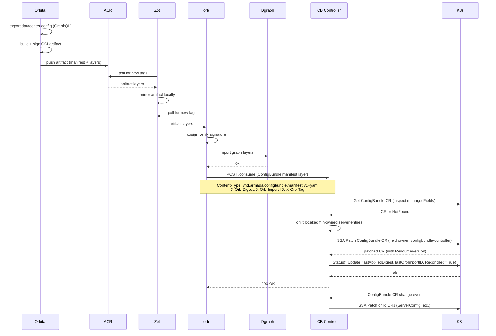

# Edge Reference

> **When to load this file:** Read this before working on the ConfigBundle Controller's consume pipeline (HTTP handler, SSA apply, status update), divergence reporting, or the edge registry (Zot).

---

## Overview

There is no separate edge agent binary. The ConfigBundle Controller is a passive consumer: it does not poll Zot, does not pull OCI artifacts, and does not call orb's import API. Instead, orb's dispatch pipeline handles all OCI mechanics (poll Zot, cosign verify, graph import) and then POSTs the manifest layer bytes to the ConfigBundle Controller via `POST /consume`. The ConfigBundle Controller receives the manifest, applies the ConfigBundle CR via SSA (respecting local admin overrides), and updates status.

---

## End-to-end dispatch flow

---

## Key decisions

- **No separate edge agent** — The ConfigBundle Controller, ConsumeServer, and Divergence Reporter are all part of the same binary on the Mgmt Cluster. Do not create an `edge-agent` binary.
- **CB Controller is a passive consumer** — it never polls Zot, never pulls OCI artifacts, and never calls cosign. Orb owns the full OCI pipeline including cosign verification.
- **CB Controller never needs OCI credentials** — orb handles all OCI mechanics including cosign verification. The ConfigBundle Controller receives plain manifest bytes over HTTP.
- **omitAdminOwnedServers is mandatory in the consume path** — the ConsumeServer handler must inspect `managedFields` and omit fields owned by `local:admin` before applying the SSA patch. The handler is a trigger for apply, not a simpler replacement of the Puller — all override-aware logic still applies.
- **If orb is down, CB Controller receives no updates until orb recovers and re-dispatches** — there is no fallback polling mechanism. The CB Controller's update cadence is fully dependent on orb's dispatch pipeline.
- **Single field manager** — `configbundle-controller` owns all fields it writes on both the ConfigBundle CR and child CRs. Local admin overrides use `local:admin` — but ONLY on the ConfigBundle CR, never on child CRs.
- **Local overrides are at ConfigBundle CR level only** — child CRs are derived state, not an override surface. The ConsumeServer applies the ConfigBundle CR spec WITHOUT `ForceOwnership` so SSA preserves locally-owned fields. The Decomposition Reconciler applies child CR specs WITH `ForceOwnership` because child CRs always faithfully reflect the ConfigBundle CR (including any local overrides already merged into it).
- **Divergence is data, not an error** — a disconnected Galleon that hasn't received a dispatch is in a valid (diverged) state. Do not block or error on lack of convergence.

---

## ConfigBundle Controller — full responsibility list

The controller is a single binary (Mgmt Cluster) with three goroutines managed by controller-runtime:

### ConsumeServer (`ctrl.Runnable`) — HTTP-driven, not time-driven

`NeedsLeaderElection() = false` — all replicas serve (applies are idempotent via SSA).

Listens on `CB_CONTROLLER_PORT` (default `:8095`).

**`POST /consume`** — receives the manifest layer from orb's dispatch pipeline:

| Header / Body | Description |
|---|---|
| `Content-Type` | Manifest media type (e.g. `application/vnd.armada.configbundle.manifest.v1+yaml`) |
| `X-Orb-Tag` | OCI tag orb resolved (e.g. `v42`) |
| `X-Orb-Digest` | OCI digest of the artifact orb pulled and verified (e.g. `sha256:…`) |
| `X-Orb-Import-ID` | Orb import run ID (for traceability into orb import history) |
| Body | Raw manifest layer bytes |

**Apply pipeline (in order):**
1. **Parse manifest** bytes into ConfigBundle CR spec fields
2. **Inspect `managedFields`** on the existing ConfigBundle CR — identify fields owned by `local:admin`
3. **`omitAdminOwnedServers`** — remove any server entries (or server fields) from the patch that are owned by `local:admin` to avoid SSA 409 conflicts
4. **SSA patch** WITHOUT `ForceOwnership`, field manager `configbundle-controller` — SSA preserves locally-owned fields. See crd-context.md § SSA conflict resolution.
5. **Process `spec.takeover[]`** — for each entry, submit a narrow SSA apply containing only that field with `ForceOwnership`, reclaiming ownership from `local:admin`. Runs regardless of step 4 success (ADR-006).
6. **Record last-applied manifest** for the Divergence Reporter to compare against
7. **Update ConfigBundle CR status** (status subresource): `lastAppliedDigest` (`X-Orb-Digest`), `lastOrbImportID` (`X-Orb-Import-ID`), `lastAppliedAt`, `Reconciled=True` condition

**Response codes:**
- `200` — manifest applied successfully; orb records this in import history
- `500` — apply failed (SSA error, parse error, etc.); orb records failure in import history and may retry

### Decomposition Reconciler (`ctrl.Reconciler`) — event-driven, triggered by ConfigBundle CR changes
1. **Decompose ConfigBundle CR** into domain child CRs via SSA WITH `ForceOwnership` — child CRs faithfully reflect the ConfigBundle CR (including any local overrides already merged into it)
2. **Set ownerReferences** on child CRs so deletion cascades when ConfigBundle is deleted
3. **Update ConfigBundle CR status**: `phase`, `Reconciled` condition

### Divergence Reporter (`ctrl.Runnable`) — scheduled
1. **Inspect `managedFields`** on each ConfigBundle CR — find fields owned by `local:admin`
2. **Compare against last applied manifest** — produce field-level divergence entries (intended vs override value)
3. **POST the full override set** to orb's divergence intake (`ORB_DIVERGENCE_INTAKE_URL`) — replace-not-merge semantics

---

## Environment variables (ConfigBundle Controller)

| Variable | Default | Description |
|---|---|---|
| `CB_CONTROLLER_PORT` | `:8095` | Listen address for `POST /consume` (ConsumeServer) |
| `ORB_DIVERGENCE_INTAKE_URL` | `http://orb:8010/api/v1/divergence` | Where the Divergence Reporter POSTs override entries |
| `DIVERGENCE_REPORTER_SCHEDULE` | `*/5 * * * *` | Cron expression (currently implemented as fixed interval) |
| `DIVERGENCE_REPORTER_ENABLED` | `false` | Default off; explicit enable per environment |

---

## Divergence tracking

- The Divergence Reporter inspects `managedFields` on the **ConfigBundle CR only** — not child CRs
- Fields owned by `local:admin` on the ConfigBundle CR are local overrides
- Divergence report contains: field path, intended value, override value, who (`local:admin`), when (`managedFields[].time`)
- Reports POSTed to orb's divergence intake (`ORB_DIVERGENCE_INTAKE_URL`) — orb translates K8s paths to orbId+field via the mapping layer and relays to S3 for orbital ingestion
- Each POST is a full replace-not-merge snapshot — if a field is no longer owned by `local:admin`, it disappears from the next report
- `overrides: []` is valid and means "no local overrides" — orbital interprets this as all divergence resolved
- A Galleon with no dispatches from orb (disconnected) still publishes divergence reports — time since last apply is tracked
- **Prerequisite:** `servers[]` has `+listType=map +listMapKey=serviceTag` (done) so SSA tracks per-entry field ownership

---

## Gotchas

- **omitAdminOwnedServers is mandatory in the consume path** — the ConsumeServer handler is a trigger for the full apply pipeline, not a simpler alternative to the Puller. All override-aware logic still applies; skipping it causes 409s that block legitimate config changes.
- **CB Controller never needs OCI credentials** — orb handles all OCI mechanics including cosign verification. Do not add OCI pull or cosign logic to the CB Controller.
- **If orb is down, CB Controller receives no updates until orb recovers and re-dispatches** — there is no fallback polling mechanism. Design orb's dispatch pipeline to handle retries and re-dispatch on recovery.
- **Local overrides are at ConfigBundle CR level only** — do not implement or support `local:admin` field managers on child CRs (ServerConfig, ClusterConfig, etc.). Child CRs are derived state. Overrides belong on the ConfigBundle CR where they are visible and tracked.
- **ConsumeServer must NOT use ForceOwnership on ConfigBundle CR** — this is what allows local overrides to persist across dispatch cycles. SSA conflict detection handles the rest.
- **Decomposition Reconciler MUST use ForceOwnership on child CRs** — child CRs always reflect the ConfigBundle CR faithfully. There is no case where a child CR field should diverge from what the ConfigBundle CR says.
- **Divergence tracking is on ConfigBundle CR managedFields only** — do not inspect child CR managedFields for divergence. The ConfigBundle CR is the single source of divergence truth.
- **Decomposition must be idempotent** — applying the same ConfigBundle manifest twice must produce the same child CRs with no side effects. SSA guarantees this if field managers are used correctly.
- **Return 500 on apply failure** — a 500 response is visible in orb's import history, giving operators a clear audit trail. Do not swallow errors and return 200.

---

## External references

- [SDD §3.2 — Edge Architecture diagram](../../SDD%20DCIM%20%26%20CMBD%20for%20Galleon%20Digital%20Twin%20in%20Atlas%20%283%29.pdf)
- [OCI artifact layer reference](bundle-context.md)
- [ConfigBundle CR structure](crd-context.md)
- [Local override / divergence model](orbital-context.md)

---

## Domain file maintenance

Update this file when:
- The ConsumeServer HTTP interface changes (headers, response codes, endpoint path)
- The apply pipeline steps change (e.g. new managedFields inspection logic)
- The divergence report format or transport is finalized
- Environment variables are added or renamed

Updates must be in the same PR as the code change that prompted them.
